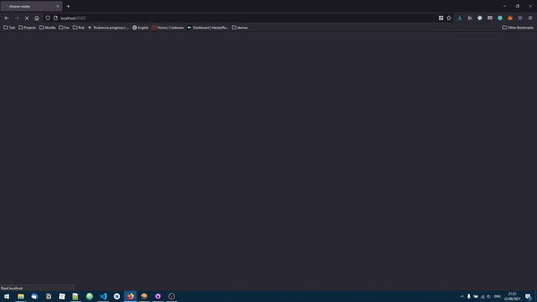

# choose-wisely
Projekt iz kolegija Blockchain aplikacije.   

Nositelj: dr. sc. Siniša Sovilj   
Izvođači: dr. sc. Nikola Tanković, Robert Šajina, mag. inf.   
Diplomski studij Informatika, FIPU 2020/2021.  

Izradila: Nikki Bernobić



## Project setup

### Install Ganache, Metamask
### Initialize MetaMask using Ganache's mnemonic. Configure Metamask to run on port 7545, chain ID 1337.
### Install and start the project
```
npm install
```
```
truffle migrate --reset --compile-all
```
```
npm run serve
```

